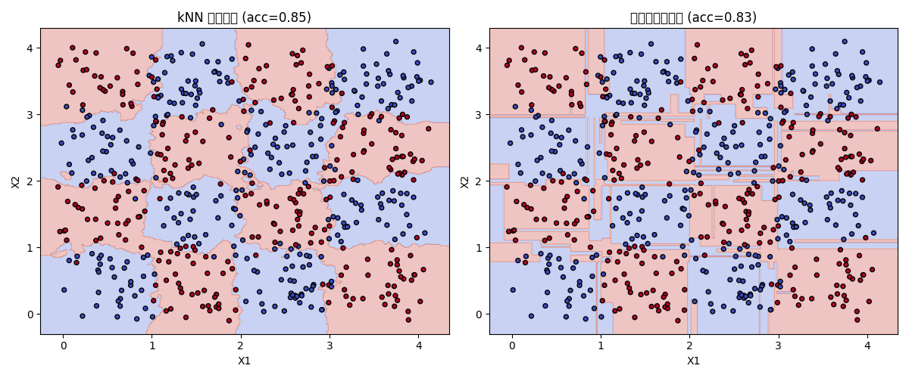
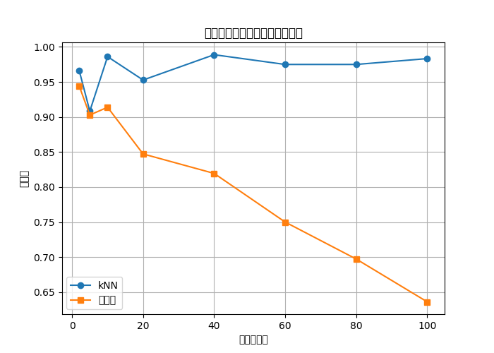
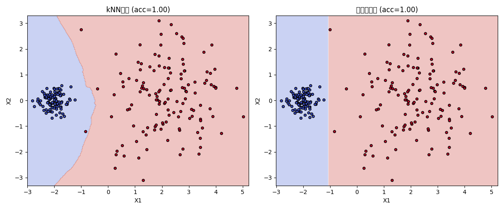

项目 A3｜机器学习方向
反例构造与验证：kNN 模型弱点的实验分析
一、项目简介

本项目围绕经典机器学习算法 kNN（K-Nearest Neighbors） 展开，目标是在实验层面验证其在特定条件下的性能弱点，并检验大模型在项目初期给出的相关预测是否符合真实运行结果。

在项目开始阶段，我与大模型进行了讨论，模型给出了关于 kNN 可能失效场景的若干判断，例如对噪声的敏感性以及在高维空间中距离度量失效的问题。基于这些预测，我设计并实现了一系列“反例构造”实验，通过代码与可视化结果对上述判断进行逐条验证。

二、实验设计与任务说明
2.1 对比模型选择

本实验选取以下两种模型进行对比：

kNN（K-Nearest Neighbors）

决策树（Decision Tree）（作为对照模型）

选择决策树的原因在于其不依赖距离度量，能够在一定程度上缓解高维空间和局部噪声带来的影响，适合作为对比参照。

2.2 核心实验假设（来自大模型预测）

实验主要围绕大模型提出的两点预测展开：

噪声敏感性假设
在存在局部噪声的情况下，kNN 的决策边界容易出现破碎和过拟合现象。

维度灾难假设（Curse of Dimensionality）
当特征维度升高时，欧氏距离逐渐失去区分能力，导致 kNN 分类准确率明显下降。

三、实验过程与结果分析
3.1 噪声敏感性验证（二维决策边界可视化）

我首先构造了一个二维分类数据集，并在样本中引入一定比例的随机噪声点。随后分别训练 kNN 和决策树模型，并绘制其在平面上的决策边界。

图 1：二维含噪数据下的决策边界对比（kNN vs 决策树）

**实验观察：**

从图中可以看到，kNN 的决策边界呈现出明显的碎片化特征，部分孤立噪声点被单独划分为小区域，整体边界较为复杂。

决策树的分类边界虽然是轴对齐的分割结构，但整体更加规整，对局部噪声点不那么敏感。

小结

该实验结果表明，kNN 对局部邻域结构高度依赖，在噪声存在时容易出现过拟合现象。大模型关于“噪声会导致 kNN 决策边界震荡”的预测在该实验中得到了验证。

3.2 维度灾难验证（高维特征实验）

在第二组实验中，我使用合成数据集，将特征维度从 2 逐步增加到 100，并记录模型在测试集上的分类准确率变化情况。

图 2：不同特征维度下模型准确率变化曲线

**实验观察：**

随着维度增加，kNN 的分类准确率出现明显下降趋势。

当维度超过约 20 后，kNN 的性能开始快速恶化。

相比之下，决策树在高维情况下的准确率下降较为缓慢，整体表现更稳定。

小结

该实验直观展示了“维度灾难”的影响。在高维空间中，样本间的欧氏距离差异逐渐减小，使得基于距离的 kNN 方法难以有效区分类别。

### 3.3 不同密度聚类场景下的表现分析

为了进一步观察模型在实际数据分布不均衡情况下的表现，
我构造了一个包含不同类别密度的二维数据集。

**实验观察：**

在样本密度较高的区域，kNN 分类效果较好。

在类别稀疏、边界附近区域，kNN 更容易受到邻近异类样本的干扰，出现误分类。

决策树在该场景下仍然保持较为稳定的分类边界。

四、差异分析：大模型预测 vs 实际结果

将实验结果与项目初期大模型给出的预测进行对比，可以得到以下结论：

4.1 验证成立的部分

大模型关于 “kNN 对噪声敏感” 的判断在二维可视化实验中得到了清晰验证。

关于 “高维空间中距离度量失效” 的预测也与实验结果高度一致。

4.2 未完全覆盖的方面

在实验过程中，我额外发现了一个未被大模型明确强调的问题：

计算效率问题
随着样本数量和特征维度增加，kNN 在预测阶段的计算时间明显上升，而决策树在推理阶段更加高效。这一工程层面的因素在初期的大模型建议中并未被重点提及。

五、总结与反思（人机协作视角）
5.1 大模型在项目中的作用

帮助我快速回顾并梳理了 kNN 的经典理论弱点。

提供了构造反例实验的整体思路，例如通过增加噪声和维度来检验模型鲁棒性。

在实验设计初期起到了“方向引导”的作用。

5.2 必须由人工完成的部分

实验参数的具体设定（如维度范围、噪声强度）。

实验结果的解释与图像分析。

判断哪些现象具有实际意义，哪些属于数据随机性波动。

5.3 可能的改进方向

本实验仅使用了欧氏距离，后续可尝试曼哈顿距离或余弦相似度以缓解高维问题。

可进一步记录模型训练与预测时间，对性能进行更全面评估。

在真实数据集上重复实验，以增强结论的普适性。

六、最终结论

通过反例构造实验，本项目验证了 kNN 在噪声干扰和高维特征空间下的明显弱点，同时也揭示了大模型预测在经典理论层面具有较高准确性，但在工程细节和复杂边界条件方面仍需要实验数据进行补充验证。